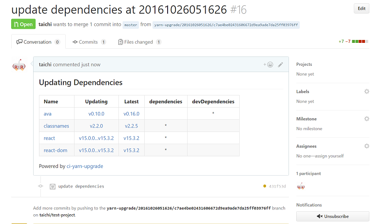

# ci-yarn-upgrade [](https://circleci.com/gh/taichi/ci-yarn-upgrade)

This command keeps npm dependencies up-to-date by making pull requests from CI.



This is inspired by [bitjourney/ci-npm-update](https://github.com/bitjourney/ci-npm-update).

## Installation

    yarn global add ci-yarn-upgrade

## Usage

### Setting Environment Variables to CircleCI

You can add environment variables using the **Project settings > Environment Variables** page of your project.

* You should set `GITHUB_ACCESS_TOKEN`
  * GitHub personal access token is required for sending pull requests to your repository
  * see. [Creating an access token for command-line use](https://help.github.com/articles/creating-an-access-token-for-command-line-use/)
* You may set `GIT_USER_NAME` and `GIT_USER_EMAIL`
  * this appliction uses `GIT_USER_NAME` and `GIT_USER_EMAIL` for commit

### Add DeployKey to GitHub from CircleCI

this command is pushing from build, so you should add read/write deployment key at **Project settings > Checkout SSH keys** page of your project.

* [Adding read/write deployment key](https://circleci.com/docs/adding-read-write-deployment-key/)

### Getting CircleCI API token

API token from your CircleCI [account dashboard](https://circleci.com/account/api).

### Configure circle.yml

our complete example is [here](https://github.com/taichi/ci-yarn-upgrade/blob/master/circle.yml).

* [Parameterized Builds](https://circleci.com/docs/parameterized-builds/)
* [Nightly Builds](https://circleci.com/docs/nightly-builds/)

#### Install dependent libraries

you should install `yarnpkg` before using this command.

    dependencies:
      pre:
        # Install Yarn
        - sudo apt-key adv --keyserver pgp.mit.edu --recv D101F7899D41F3C3
        - echo "deb http://dl.yarnpkg.com/debian/ stable main" | sudo tee /etc/apt/sources.list.d/yarn.list
        - sudo apt-get update -qq
        - sudo apt-get install -y -qq yarn


#### Configure Parameterized Builds

`YARN_UPGRADE` environment variable is injected from Parameterized Build API.

    deployment:
      update-dependencies:
        branch: master
        commands:
          - >
            if [ -n "${YARN_UPGRADE}" ] ; then
              yarn global add ci-yarn-upgrade
              ci-yarn-upgrade --execute
            fi

## Command Behavior

By default, ci-yarn-upgrade runs in dry-run mode.

    ci-yarn-upgrade

this command works locally and output result to standard output.


### execution

    ci-yarn-upgrade --execute

if you set `--execute`, this command push branch to remote, and make a pull request.

### CLI options

    Usage: ci-yarn-upgrade [options]

    Keep NPM dependencies up-to-date with CI, providing version-to-version diff for each library

    Options:

      -h, --help                   output usage information
      -V, --version                output the version number
      -n, --username <username>    specify the commit auther name. You may set GIT_USER_NAME to environment variable.
      -e, --useremail <useremail>  specify the commit auther email. You may set GIT_USER_EMAIL to environment variable.
      -t, --token <token>          specify personal access token for GitHub. use only for debugging purpose. You should set GITHUB_ACCESS_TOKEN to environment variable.
      --execute                    if you don't specify this option, allows you to test this application.
      -v, --verbose                shows details about the running ci-yarn-upgrade
      -k, --keep                   if you specify this option, keep working branch after all.
      --prefix <prefix>            specify working branch prefix. default prefix is "yarn-upgrade/"
      --workingdir <path>          specify project root dir. it contains package.json. default path is /path/to/myproject

## Development

### Setup

    git clone https://github.com/taichi/ci-yarn-upgrade
    cd ci-yarn-upgrade
    yarn install

### Heroku Scheduler

If you want to setup heroku schedulers, there's a template for it:

[](https://heroku.com/deploy?template=https://github.com/taichi/ci-yarn-upgrade)

To test it, run the following command:

```sh
heroku run './build-circleci'
```

## License

```
Copyright 2016 taichi

Licensed under the Apache License, Version 2.0 (the "License");
you may not use this file except in compliance with the License.
You may obtain a copy of the License at

    http://www.apache.org/licenses/LICENSE-2.0

Unless required by applicable law or agreed to in writing, software
distributed under the License is distributed on an "AS IS" BASIS,
WITHOUT WARRANTIES OR CONDITIONS OF ANY KIND, either express or implied.
See the License for the specific language governing permissions and
limitations under the License.
```
